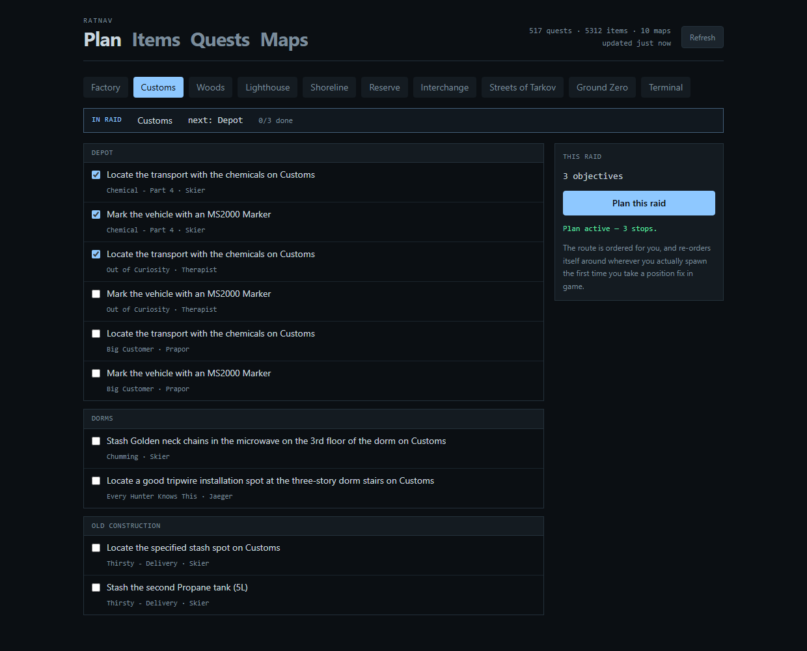

# RatNav

A raid planner and navigation overlay for Escape from Tarkov.

Plan your raid before you queue — pick the map, check off the quest objectives you're pushing, and RatNav
builds a route with the keys you need to bring and the items you're hunting. In raid, a hotkey-toggled
overlay shows that route on the map, tells you the bearing and distance to your next stop, and re-plans from
wherever you actually are.

**Status: working, and rough. Not yet released.**

## Is this safe to use?

Yes, and here is exactly why.

RatNav reads **two things the game already writes to your own disk**:

- **Log files** (`<EFT install>\Logs\log_<date>_<version>\*application.log`) — for the map you loaded into,
  raid start and end, and quest accept/complete events.
- **Screenshot filenames** (`Documents\Escape from Tarkov\Screenshots`) — Escape from Tarkov encodes your
  world coordinates and camera rotation into the name of every screenshot it saves. That is where your
  position on the map comes from.

RatNav does **not**:

- read or write game memory
- inject code into the game process
- hook DirectX, Direct3D, or the game's rendering
- modify any game file
- send synthetic keyboard or mouse input to the game
- collect telemetry, require an account, or phone home

The overlay is an ordinary top-level Windows window composited by the desktop compositor, exactly like any
other application window. Nothing attaches to the game.

The only network requests RatNav makes are to [tarkov.dev](https://tarkov.dev) for game data and to
community map image hosts.

## What it does

**Before the raid.** Pick a map. RatNav lists the objectives of your active quests, grouped by the
place players actually call it — Depot, Dorms, Old Construction — with the quest and trader for
each. Tick what you are pushing and it builds a route, aggregates the keys you need to bring, and
assembles the shopping list.

**During the raid.** A hotkey-toggled overlay shows the route, your position, and the distance and
bearing to your next stop: *Dorms · 140 m · 30° right*. Tap your screenshot key and the marker
snaps, the route re-orders from where you actually are, and the screenshot is archived so the
folder never fills up.

**Between raids.** What every active quest and un-built hideout module needs, minus what you have,
with a watchlist for anything else worth remembering.

**With a friend.** Export a plan, merge it with theirs. Nothing is dropped — every objective
survives carrying its owner — and it flags what actually changes the raid: objectives to do
together, items you are both hunting, and keys only one of you needs to carry.

## How position works

Escape from Tarkov writes your coordinates into the filename of every screenshot you take. So your
screenshot key **is** RatNav's "where am I" key:

1. Bind a screenshot key in **Tarkov → Settings → Controls → Screenshot** (a mouse thumb button works well;
   Steam users should avoid F12).
2. Tap it in raid.
3. RatNav parses the filename, snaps your marker to that spot with your facing, re-plans the remaining route
   from where you now stand, and tells you the bearing and distance to your next objective.

Position updates when you tap, and only when you tap. There is no continuous tracking, because reading
position continuously would require reading game memory — which is what anti-cheat exists to catch. Every
ban-safe tool in this space works the same way.

## What it will not pretend to know

Being useful mid-raid means being trustworthy, so RatNav says when it is unsure rather than
guessing:

- A map whose calibration could not be established from the data **says so**, instead of showing
  a pin that might be 75 metres out.
- Quest progress read from the game's logs sits *under* anything you correct by hand. A later
  replay can never undo your correction.
- Your stash is not in any file on disk, so have-counts are entered by hand. RatNav will not
  guess at them.
- When tarkov.dev is down — it was, for a full day during development — the last good data keeps
  being served and the app tells you it is stale.

## Hotkeys

| | |
|---|---|
| *your in-game screenshot key* | take a position fix |
| `Alt` + `` ` `` | show or hide the overlay |
| `Alt` + `Shift` + `` ` `` | open the full panel |
| `Alt` + `I` | let the mouse reach the overlay, to pan or tick something off |
| `Alt` + `\` | tick the current objective off |

All rebindable. RatNav registers each combination with Windows rather than watching the keyboard,
and tells you if another application already owns one.

## Building it

See [CONTRIBUTING.md](CONTRIBUTING.md). Short version: `npm run build` in `web/`, then
`dotnet run --project src/RatNav.App`.

## Requirements

- Windows 10/11
- Escape from Tarkov running in **Borderless** or **Windowed** mode. Exclusive fullscreen renders above all
  overlays; that is an operating system limitation, not something any tool can work around.

## Credits

RatNav is built on data generously maintained by the community:

- [tarkov.dev](https://tarkov.dev) and [the-hideout/tarkov-api](https://github.com/the-hideout/tarkov-api) —
  quests, items, hideout requirements, prices
- The map makers whose work those projects distribute
- [the-hideout/TarkovMonitor](https://github.com/the-hideout/TarkovMonitor) — prior art for reading
  game logs safely, and the reason quest tracking took hours rather than days
- The map authors credited in the data itself — RatNav names them in the app

Escape from Tarkov is a trademark of Battlestate Games. RatNav is an unofficial fan project with no
affiliation.

## License

MIT — see [LICENSE](LICENSE).
