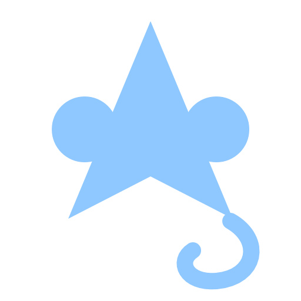
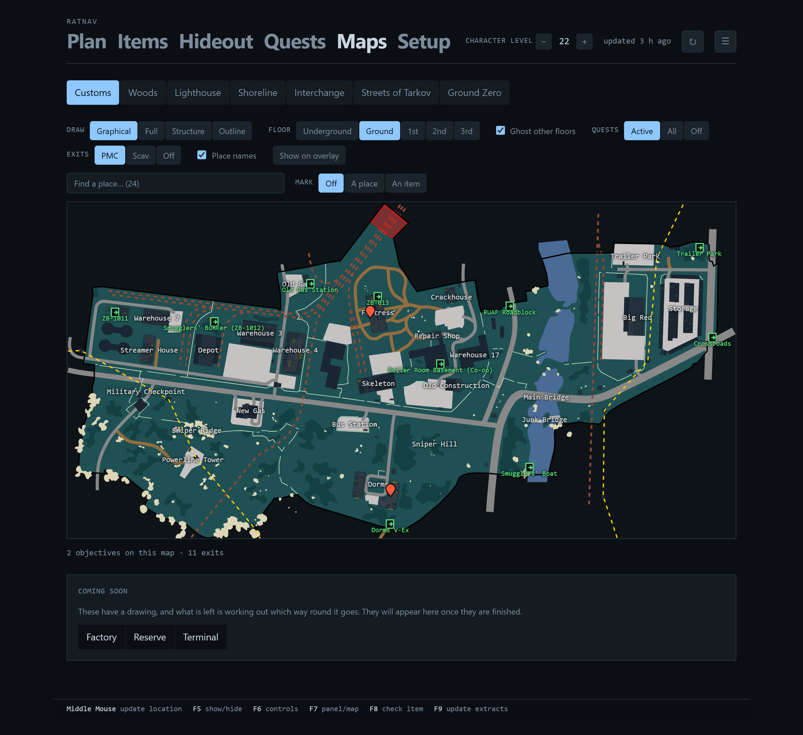
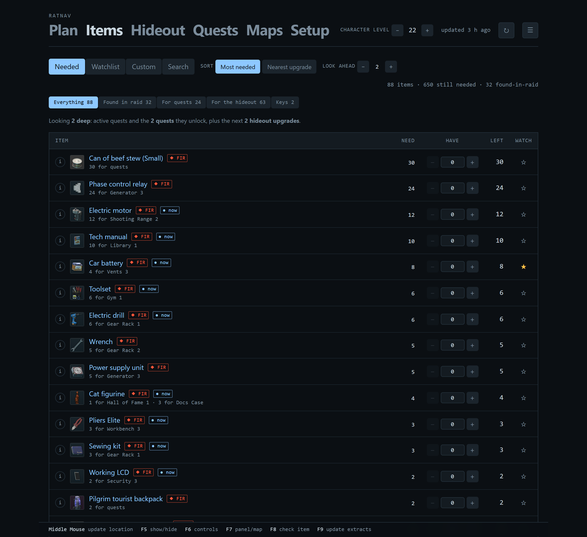
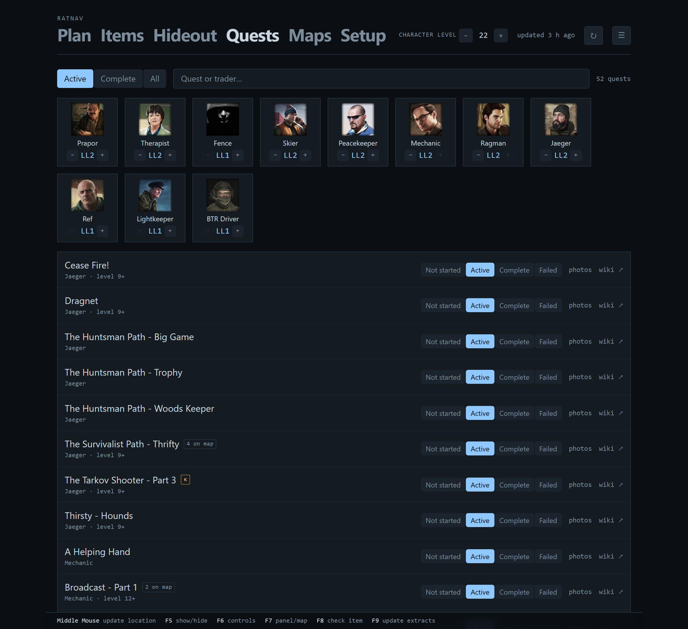
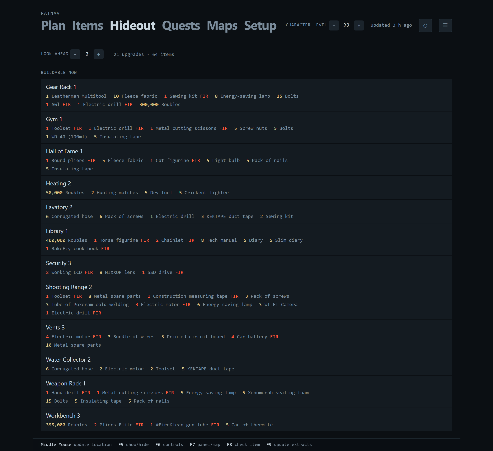
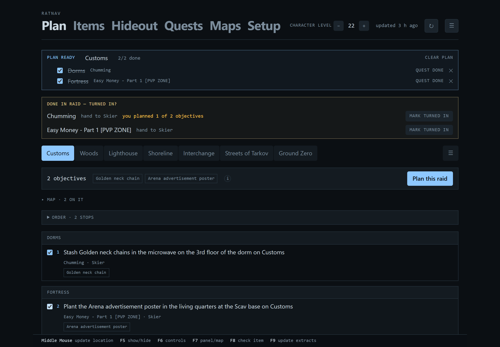
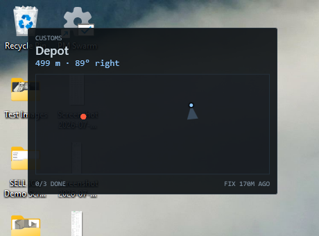

# RatNav

A raid planner and navigation overlay for Escape from Tarkov.

Plan your raid before you queue — pick the map, check off the quest objectives you're pushing, and RatNav
builds a route with the keys you need to bring and the items you're hunting. In raid, a hotkey-toggled
overlay shows that route on the map, tells you the bearing and distance to your next stop, and re-plans from
wherever you actually are.

## Alpha

RatNav works and is used daily, but it is early. Expect rough edges, expect things to move, and
expect a version that is not yet the one it will settle into.

Concretely, that means:

- **Not every map is in yet.** The ones still being worked on are marked `[WIP]`, and a stable
  release only ever contains finished ones.
- **Features are still arriving**, and some of them change shape between versions.
- **Your data is yours and stays put.** Progress, counts and plans live in
  `%LOCALAPPDATA%\RatNav` and survive updates and uninstalls alike.

If you would rather wait, watch the repository — the [latest
release](https://github.com/mrthames/RatNav/releases/latest) is always the one to download.

📖 **[Full guide](docs/GUIDE.md)** · ❓ **[FAQ and troubleshooting](docs/FAQ.md)**

## Install

<!-- latest-stable --> Latest stable release: see [releases](https://github.com/mrthames/RatNav/releases/latest).

1. Download the setup executable from the
   [latest release](https://github.com/mrthames/RatNav/releases/latest) and run it.

   It installs for your user only — no administrator prompt — and adds RatNav to your Start Menu.
   Nothing else needs installing; the .NET runtime is included. There is a portable `.zip` on the
   same page if you would rather unzip it and run `RatNav.exe` yourself.

2. Start RatNav, then open **Setup** (the tray icon's *Open panel*, or
   `http://localhost:8722/` in any browser).

3. Work down the checks. Each one that is not green says what to do about it. Then set:

   - **Escape from Tarkov folder** — the folder containing `EscapeFromTarkov.exe`. RatNav tries to
     find this for you, and Setup shows what it found. Override it if that is wrong: RatNav has no
     idea where you installed the game, an old copy on another drive looks the same as a live one,
     and a wrong folder shows up as an overlay that never reports a raid.
   - **Screenshot folder** — where the game saves screenshots. Defaults to
     `Documents\Escape from Tarkov\Screenshots`, which is right unless OneDrive has moved your
     Documents folder — a common cause of RatNav seeing nothing.
   - **Your in-game screenshot key** — whatever you bound in Tarkov. RatNav never presses it; this
     is so every prompt names the key *you* use. See [How position works](#how-position-works).
   - **Hotkeys** — click a field and press the key you want. Defaults are `F5`–`F9`. Changes take
     effect immediately, and RatNav tells you if another application already owns a combination.
   - **Your name on shared plans** — only matters if you swap plans with someone.

4. In Tarkov, bind a **Screenshot** key under *Settings → Controls*, and set the game to
   **Borderless** or **Windowed**. Exclusive fullscreen renders above every overlay; that is an
   operating system limit, not something any tool can work around.

Setup re-checks itself every few seconds, so you can leave it open, launch the game, and watch the
checks go green.

Nothing is hardcoded. Every path is either detected or set by you, and RatNav says which.

## Is this safe to use?

*(The short version. The long one, with everything checkable against the source, is in
[docs/SAFETY.md](docs/SAFETY.md).)*

Yes, and here is exactly why.

RatNav reads **two things the game already writes to your own disk**:

- **Log files** (`<EFT install>\Logs\log_<date>_<version>\*application.log`) — for the map you loaded into,
  raid start and end, and quest accept/complete events.
- **Screenshot filenames** (`Documents\Escape from Tarkov\Screenshots`) — Escape from Tarkov encodes your
  world coordinates and camera rotation into the name of every screenshot it saves. That is where your
  position on the map comes from.

RatNav does **not**:

- read or write game memory
- inject code into the game process
- hook DirectX, Direct3D, or the game's rendering
- modify any game file
- send synthetic keyboard or mouse input to the game
- collect telemetry, require an account, or phone home

The overlay is an ordinary top-level Windows window composited by the desktop compositor, exactly like any
other application window. Nothing attaches to the game.

The only network requests RatNav makes are to [tarkov.dev](https://tarkov.dev) for game data and to
community map image hosts.

## What it does

**Before the raid.** Pick a map. RatNav lists the objectives of your active quests, grouped by the
place players actually call it — Depot, Dorms, Old Construction — with the quest and trader for
each. Tick what you are pushing and it builds a route, aggregates the keys you need to bring, and
assembles the shopping list.

**During the raid.** A hotkey-toggled overlay shows the route, your position, and the distance and
bearing to your next stop: *Dorms · 140 m · 30° right*. Tap your screenshot key and the marker
snaps, the route re-orders from where you actually are, and the screenshot is archived so the
folder never fills up.

**Between raids.** What every active quest needs, minus what you have, with a watchlist for
anything else worth remembering — filtered to found-in-raid, or keys, or whatever a trade is
waiting on.

**Track something of your own.** "Document case", and the seven plugs it takes. Each item has a
`+`/`−` and the number shown is what is **left** — found four of six and it asks for two. Counted
*apart* from quests and the hideout, because an item wanted three times for a quest and seven for
a barter is two reasons, not a single ten.

**Click a waypoint to read the quest.** What it wants, which step this pin serves, and the wiki's
screenshots of the place — which is what turns "walk to this pin" into "find this door".

**Marks of your own.** Click a spot on the map, name it, and it draws in raid from then on. They
are not part of a plan, so they outlive every plan.

**Quest photos.** The wiki's screenshots for a quest, from the app — the ones showing which
building and which door.

**The hideout, as a build order.** Tell RatNav where each station is and it works out what that
makes reachable next, following the game's own prerequisites. A **Look ahead** control decides how
far: 1 is what you could build tonight, 3 is what to stop vendoring. On a fresh hideout that is
about 17 items rather than the several hundred an un-filtered list would give you. Star the
upgrades you actually want and the list narrows to those.

**With a friend.** Export a plan, merge it with theirs. Nothing is dropped — every objective
survives carrying its owner — and it flags what actually changes the raid: objectives to do
together, items you are both hunting, and keys only one of you needs to carry.

## The app

Everything above, on a second screen or in the expanded overlay — the same app either way, so there
is one place to learn rather than two.

**Maps.** Every objective of every active quest, on the map, with extracts, place names and four
levels of detail. **Coming soon** lists maps that have a drawing and are one position away from
being finished; a map with no drawing anywhere is not listed and not promised.

**Items.** What every active quest and reachable hideout upgrade wants, minus what you have, with
what each one is *for* on the line beneath it. Filter to found-in-raid, or keys, or the hideout.

**Quests.** Every trader with their portrait and loyalty level, and each quest's state as four
buttons — with a link to the wiki and the wiki's own screenshots of the place.

**Hideout.** What you could build now, then what one more upgrade unlocks, each module listing what
it still takes. Found-in-raid marked in red, because those are the ones you cannot buy your way out
of later.

**Plan.** Tick the objectives you are pushing. One strip that does not move says how many you have
picked and what they need you to bring — keys in red — with the map folded below it and the
checklist under that.

## How position works

Escape from Tarkov writes your coordinates into the filename of every screenshot you take. So your
screenshot key **is** RatNav's "where am I" key:

1. Bind a screenshot key in **Tarkov → Settings → Controls → Screenshot**. A mouse thumb button
   works well — it is reachable without letting go of movement. Steam users should avoid `F12`.
2. Tell RatNav which key that is, in Setup. It never presses it; it just names it in prompts.
3. Tap it in raid.
4. RatNav parses the filename, snaps your marker to that spot with your facing, re-plans the
   remaining route from where you now stand, and tells you the bearing and distance to your next
   objective.

Position updates when you tap, and only when you tap. There is no continuous tracking, because reading
position continuously would require reading game memory — which is what anti-cheat exists to catch. Every
ban-safe tool in this space works the same way.

## How it behaves

- **Your corrections stick.** Quest progress read from the game's logs sits *under* anything you
  set by hand, so a later log replay can never undo it.
- **Offline keeps working.** When tarkov.dev is unreachable the last good data keeps being served
  and the app says how old it is.
- **A map marked `[WIP]` is one still being worked on.** Those are not in a stable release.

## Hotkeys

| | |
|---|---|
| *your in-game screenshot key* | take a position fix |
| `F5` | show or hide the overlay |
| `F6` | let the mouse reach the overlay — move, resize, zoom, and the map controls |
| `F7` | switch between the corner box and the centred map |
| `F8` | say what the item under your cursor is for |
| `F9` | read the extract list the game is showing, and draw only those |

All rebindable. RatNav registers each combination with Windows rather than watching the keyboard,
and tells you if another application already owns one.

### Identifying an item

Hover an item so its tooltip is showing and press `F8`. RatNav reads the tooltip **off the
screen** — the same pixels a screenshot tool sees, using the OCR built into Windows — and tells you
which quests want it, which hideout station and level needs it, whether it opens a door, and which
traders will take it in trade.

It is a key rather than shift-click on purpose. Catching a mouse click over another application
needs a system-wide mouse hook, which is the same machinery RatNav refuses to use for the keyboard,
and for the same reason. A hotkey is registered with Windows the ordinary way and touches nothing.

OCR misreads, so RatNav says how sure it is rather than presenting a guess as fact.

## The map

The overlay draws the real map, and how it draws is yours to set. Press `F6` and a control stack
appears down the side:

| | |
|---|---|
| **Floor** | Steps through the map's levels. A fix picks the floor on its own from the height you are at; choosing one by hand lasts until your next fix. Other floors draw solid where nothing on yours sits above them, dashed and dim only where they genuinely stack. |
| **Draw** | `graphical` uses the map's own palette, the way its author drew it. `full`, `structure` and `outline` drop whole categories of detail rather than fading everything — which is what you want over a firefight. |
| **Fade / Line** | How strongly the overlay is drawn over the game, and how heavy the map's own strokes are. |
| **Pins / Text / You** | Separate size dials for markers, captions, and your own marker — with **Shrink** deciding how much they ease off as you zoom out. |
| **Map** | `still` holds the map and lets your marker travel across it; `follows you` keeps you centred. |
| **Exits** | `pmc`, `scav`, `both`, or `off`. Shared extracts show under either. `F9` narrows it to the ones the game says are open this raid. |
| **Size** | How large RatNav draws its own controls. The defaults suit 1080p; turn it up on a bigger screen. |

Two drawers open from the bottom-left: the **quest log** and the **items list**. Either can swap
sides, collapse, or tear off into its own window for a second monitor.

Everything here is remembered — placement, zoom and opacity per presentation, so setting up the
corner box does not disturb the centred map.

The full tour is in the **[guide](docs/GUIDE.md)**.

## Building it

See [CONTRIBUTING.md](CONTRIBUTING.md). Short version: `npm run build` in `web/`, then
`dotnet run --project src/RatNav.App`.

## Answers to the first questions people ask

- **Will I get banned?** RatNav does not touch the game — no memory, no injection, no hooks, no
  synthetic input. See [Is this safe to use?](#is-this-safe-to-use) above and the
  [FAQ](docs/FAQ.md).
- **Nothing appears over the game.** The game is in exclusive fullscreen. Switch to Borderless.
- **The overlay never notices a raid.** It is watching the wrong game folder — check Setup.
- **Why do I have to press a key to see where I am?** Because a filename is the only place Tarkov
  writes your position. [The long answer](docs/FAQ.md#why-do-i-have-to-press-a-key-to-see-where-i-am).
- **Why do I have to type my quests, stash and trader levels in?** None of them are on disk in a
  form anything can read, and the only interface that knows them wants your account password.

There are twenty more in the **[FAQ](docs/FAQ.md)**.

## Requirements

- **Windows 10 version 1809 or later.** Identifying an item under your cursor additionally needs
  Windows 10 version 2004, and says so plainly when it is unavailable.
- **Escape from Tarkov in Borderless or Windowed mode.** Exclusive fullscreen renders above all
  overlays; that is an operating system limitation, not something any tool can work around.
- A screenshot key bound in game. Everything else RatNav needs, it reads or asks for.

Nothing needs to be installed alongside it — no .NET runtime, no OCR download, no account.

## Support it

RatNav is free, has no ads, no accounts, and nothing that phones home. It is built and maintained
by one person on his own time.

☕ **[Buy me a coffee](https://buymeacoffee.com/thames_)** — it keeps this and the other things I
make free for everyone.

## Credits

RatNav is built on data generously maintained by the community:

- [tarkov.dev](https://tarkov.dev) and [the-hideout/tarkov-api](https://github.com/the-hideout/tarkov-api) —
  quests, items, hideout requirements, prices
- The map makers whose work those projects distribute
- [the-hideout/TarkovMonitor](https://github.com/the-hideout/TarkovMonitor) — prior art for reading
  game logs safely, and the reason quest tracking took hours rather than days
- The map authors credited in the data itself — RatNav names them in the app
- The [Escape from Tarkov Wiki](https://escapefromtarkov.fandom.com), for the quest screenshots
  RatNav shows. They are loaded from the wiki and credited there, never redistributed; the wiki's
  text and images are CC BY-SA.

Escape from Tarkov is a trademark of Battlestate Games. RatNav is an unofficial fan project with no
affiliation.

## License

**[PolyForm Noncommercial 1.0.0](LICENSE)** — free for anything that is not about making money.

Use it, change it, fork it, share your fork. What is not permitted is selling it, charging for
access to it, or building a paid product on top of it.

The **name "RatNav" and the mark** are not part of that licence — copyright licences never cover a
name — so please give your fork its own. Saying it is based on RatNav is accurate and welcome; being
called RatNav Plus is not, because then nobody can tell which one they downloaded.

RatNav reads only what the game already writes to your disk, and never touches the game itself.
**[How it works, and why it is built that way](docs/SAFETY.md)** sets that out in full, along with
the one thing nobody can promise: Battlestate Games set the rules for their own game and can change
them. RatNav is used at your own risk.
