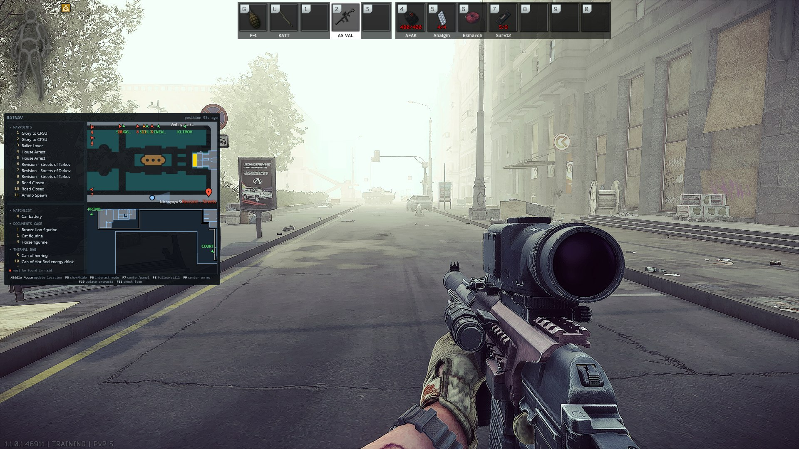
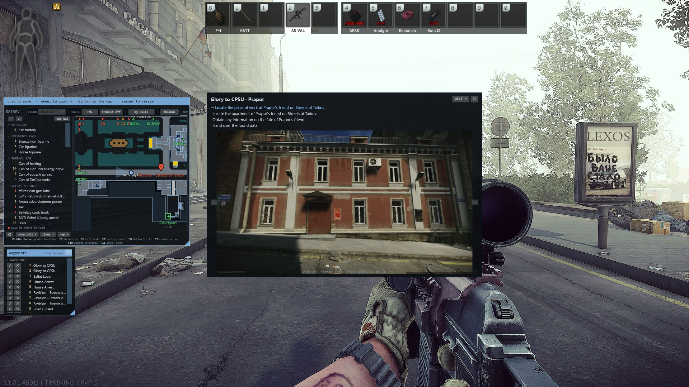
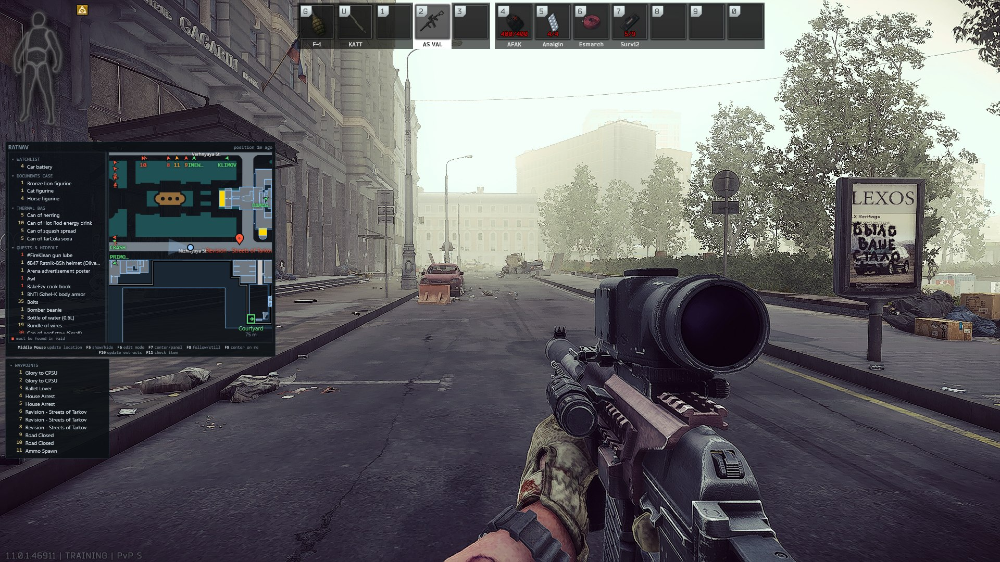

# RatNav

A raid planner and navigation overlay for Escape from Tarkov.

Plan your raid before you queue — pick the map, tick the quest objectives you are pushing, and RatNav
numbers them in the order you ticked, works out which keys you have to bring, and assembles the
shopping list. In raid, a hotkey-toggled overlay draws those stops on the real map, with you among
them.

Free, and deliberately small. It keeps the notes and draws the map; working the raid out is still
your job, and that is the point.

## Read this before you install it

Plainly, so you can decide rather than assume. None of it is buried anywhere else.

**Battlestate Games have not approved this, and I have not asked them to.** RatNav does not touch
the game: it never reads the game's memory, injects code, hooks rendering or the keyboard, changes
any game file, or sends input to the game. That is the line every tool that is safe to run stays
behind, and here it is enforced by a check that fails the build rather than by my word for it.

But **avoiding the techniques anti-cheat looks for is not the same as being permitted.** Battlestate
set the rules for their own game, those rules cover more than cheating software, and they can change
them whenever they like. Nobody outside Battlestate can tell you where they land on a tool that
turns coordinates the game itself writes into a position on a map. Anyone who sounds certain either
way is guessing, me included. **You are accepting that uncertainty, and it is your account.**

**What it reads:** the game's log files, and the coordinates Tarkov writes into the filename of
every screenshot you take. Both already on your disk, both read-only. Nothing is sent anywhere.
There is no account, no telemetry and no server of mine.

**What it runs:** a small web service on your own machine, so one app can serve the overlay and the
browser page. It answers on `127.0.0.1` only, unless you turn on network access yourself. If you
do, there is no password: anything on your wifi can read your plan. It cannot change your settings,
wipe your progress or close the app, but read that switch's description before you use it.

**It is alpha, and it is one person's side project.** Expect rough edges.

If any of that is more than you want to take on, that is a reasonable place to land. The maps and
quest sites everybody already uses will not get you banned, and learning the maps is most of the
game.

## Deliberately small

A notepad and a map, not a system to live inside. Free — no account, no ads, no telemetry, no paid
tier.

Four things it does not do, on purpose:

- **Work out your route.** You tick objectives in the order you mean to walk them; that is the
  order it draws.
- **Follow you around.** Position updates when you tap your screenshot key, and only then.
- **Read your stash, level or trader loyalty.** You tell it once and correct it when it drifts.
- **Play for you.** No automation, no input sent to the game.

Learning the maps and finding the door is the game. RatNav takes the bookkeeping: which quest
wanted this, which key opens that, how many you still need.

## Alpha

RatNav works and is used daily, but it is early. Expect rough edges, expect things to move, and
expect a version that is not yet the one it will settle into.

Concretely, that means:

- **Not every map is in yet.** The ones still being worked on are marked `[WIP]`, and a stable
  release only ever contains finished ones.
- **Features are still arriving**, and some of them change shape between versions.
- **Your data is yours and stays put.** Progress, counts and plans live in
  `%LOCALAPPDATA%\RatNav` and survive updates and uninstalls alike.

If you would rather wait, watch the repository — the [latest
release](https://github.com/mrthames/RatNav/releases/latest) is always the one to download.

📖 **[Full guide](docs/GUIDE.md)** · ❓ **[FAQ and troubleshooting](docs/FAQ.md)**

## What it looks like

**In raid, two ways.** `F7` switches between them, and each keeps its own zoom, ink and position.

A **panel in the corner**: your plan's stops numbered to match the pins on the map, the items to
look for beside it, and the real map with extracts and place names. The key bindings sit along the
bottom.

*The four shots below are one raid on Streets of Tarkov, at 1080p, on the settings a new install
gets.*

**Click a waypoint and the quest opens over it** — what it wants, which step this stop is, and the
wiki's own photographs of the place, without leaving the game.

**Or take the lists off the map.** Each tears off into a window of its own, parked wherever suits
your screen. They stay part of the overlay: same size, same fade, clicks passing through, and gone
with it when you press hide.

Or the **centered view** — the same map drawn as glowing outlines over the game, **turned so what is
in front of you is up the screen**, with you in the middle of it. Size and place it where you like,
or turn **Coverage** to 100% for a full-screen HUD. Clicks pass straight through except on a
control, so it can stay up while you play.

**Before you queue**, the app: tick the objectives you are pushing and it numbers them in that
order, collects the keys to bring, and assembles the shopping list. There is a tour of every page
[further down](#the-app).

## Install

<!-- latest-stable --> Latest stable release: **[v0.4.0](https://github.com/mrthames/RatNav/releases/latest)** — download `RatNav-0.4.0-setup.exe`.

1. Download the setup executable from the
   [latest release](https://github.com/mrthames/RatNav/releases/latest) and run it.

   It installs for your user only — no administrator prompt — and adds RatNav to your Start Menu.
   Nothing else needs installing; the .NET runtime is included. There is a portable `.zip` on the
   same page if you would rather unzip it and run `RatNav.exe` yourself.

2. Start RatNav, then open **Setup** (the tray icon's *Open panel*, or
   `http://localhost:8722/` in any browser).

3. Work down the checks. Each one that is not green says what to do about it. Then set:

   - **Escape from Tarkov folder** — the folder containing `EscapeFromTarkov.exe`. RatNav tries to
     find this for you, and Setup shows what it found. Override it if that is wrong: RatNav has no
     idea where you installed the game, an old copy on another drive looks the same as a live one,
     and a wrong folder shows up as an overlay that never reports a raid.
   - **Screenshot folder** — where the game saves screenshots. Defaults to
     `Documents\Escape from Tarkov\Screenshots`, which is right unless OneDrive has moved your
     Documents folder — a common cause of RatNav seeing nothing.
   - **Your in-game screenshot key** — whatever you bound in Tarkov. RatNav never presses it; this
     is so every prompt names the key *you* use. See [How position works](#how-position-works).
   - **Hotkeys** — click a field and press the key you want. Defaults are `F5`–`F11`, in the
     order you use them. Changes take
     effect immediately, and RatNav tells you if another application already owns a combination.
   - **Your name on shared plans** — only matters if you swap plans with someone.

4. In Tarkov, bind a **Screenshot** key under *Settings → Controls*, and set the game to
   **Borderless** or **Windowed**. Exclusive fullscreen renders above every overlay; that is an
   operating system limit, not something any tool can work around.

Setup re-checks itself every few seconds, so you can leave it open, launch the game, and watch the
checks go green.

Nothing is hardcoded. Every path is either detected or set by you, and RatNav says which.

### Updating

Download the new setup executable and run it. It installs over the top — same place, same Start
Menu entry — and **everything you have recorded is left alone**: progress, item counts, plans,
waypoints, hotkeys and settings all live in `%LOCALAPPDATA%\RatNav`, which the installer does not
touch.

**Quit RatNav first**, from the tray icon or **Setup → Quit RatNav**. An installer cannot replace
files that a running program has open.

Once a day RatNav asks GitHub whether there is a newer stable release and says so on **Setup**,
with a link. It never downloads or runs anything itself. Turn the check off there if you would
rather watch the [releases page](https://github.com/mrthames/RatNav/releases) yourself.

## Is this safe to use?

*(The short version. The long one, with everything checkable against the source, is in
[docs/SAFETY.md](docs/SAFETY.md).)*

Yes, and here is exactly why.

RatNav reads **two things the game already writes to your own disk**:

- **Log files** (`<EFT install>\Logs\log_<date>_<version>\*application.log`) — for the map you loaded into,
  raid start and end, and quest accept/complete events.
- **Screenshot filenames** (`Documents\Escape from Tarkov\Screenshots`) — Escape from Tarkov encodes your
  world coordinates and camera rotation into the name of every screenshot it saves. That is where your
  position on the map comes from.

RatNav does **not**:

- read or write game memory
- inject code into the game process
- hook DirectX, Direct3D, or the game's rendering
- modify any game file
- send synthetic keyboard or mouse input to the game
- collect telemetry, require an account, or phone home

The overlay is an ordinary top-level Windows window composited by the desktop compositor, exactly like any
other application window. Nothing attaches to the game.

The only network requests RatNav makes are to [tarkov.dev](https://tarkov.dev) for game data and to
community map image hosts.

## What it does

**Before the raid.** Pick a map and RatNav lists your active quests' objectives, grouped by the
place players actually call it — Depot, Dorms, Old Construction. Tick what you are pushing, in the
order you mean to walk it. It numbers the stops that way, collects the keys to bring, and
assembles the shopping list.

**During the raid.** A hotkey-toggled overlay shows your stops and your position on the real map,
either as a corner panel or as a full-screen HUD turned to face the way you are. Tap your
screenshot key: the marker snaps, the centered view turns, and the screenshot is archived.

**Between raids.** What every active quest needs, minus what you have, plus a watchlist. Filter to
found-in-raid, keys, or the hideout.

**Three characters, kept apart.** PvE, PvP and PvP Seasonal each keep their own quests, hideout,
loyalty and level. Switch from the menu in the navigation; start one over from Setup.

**Track something of your own.** "Document case", and the seven plugs it takes. `+`/`−` on each
item, and the number shown is what is **left**. Counted apart from quests and the hideout.

**Click a waypoint to read the quest.** What it wants, which step this pin serves, and the wiki's
screenshots of the place.

**Marks of your own.** Click a spot on the map, name it, and it draws in raid from then on. They
live per map, so they outlive every plan — and they can join one, ticked and numbered alongside
the quest objectives.

**Quest photos.** The wiki's screenshots for a quest, from the app — the ones showing which
building and which door.

**The hideout, as a build order.** Tell RatNav where each station is and it works out what that
makes reachable next, following the game's own prerequisites. A **Look ahead** control decides how
far past today: 0 is what you could build tonight, 2 is what to stop vendoring. On a fresh hideout that is
about 17 items rather than the several hundred an un-filtered list would give you. It is one
number shared by the Hideout page, the Items page and the overlay, so turning it anywhere turns it
everywhere.

**With a friend.** Export a plan, merge it with theirs. Every objective survives carrying its
owner, and it flags what changes the raid: objectives to do together, items you are both hunting,
and keys only one of you needs to carry.

## The app

Everything above, on a second screen or in the expanded overlay — the same app either way.

**Maps.** Every objective of every active quest, on the map, with extracts, place names and four
levels of detail. **Coming soon** lists maps that are one position fix away from being finished.

**Items.** What every active quest and reachable hideout upgrade wants, minus what you have, with
what each one is *for* on the line beneath it. Filter to found-in-raid, or keys, or the hideout.

**Quests.** Every trader with their portrait and loyalty level, and each quest's state as four
buttons — with a link to the wiki and the wiki's own screenshots of the place. Setting up is done
from the keyboard: type part of a name, press **Enter** to mark it active, and the box clears
itself for the next one.

**Hideout.** What you could build now, then what one more upgrade unlocks, each module listing what
it still takes. Found-in-raid marked in red.

**Plan.** Pick a map, then tick the objectives you are pushing. A strip that does not move says how
many you have picked and what to bring, keys in red. The checklist beneath it is grouped by place,
with your own marks at the top. What you tick first is where you go first, and each tick shows the
number that stop will carry.

Once a plan exists the page folds down to it: the stops in order, **+ Add a stop to this plan** at
the foot, and **End raid** on the strip.

**On a phone or tablet, if you want it.** **Setup → Reach RatNav from a phone or tablet** makes the
service answer on your machine's network address, so an iPad on the same wifi can open it in a
browser. Nothing is installed on the other device, and a plan you build there reaches the overlay
immediately.

Off until you turn it on, and **nothing outside your network can reach it**. There is no password
either, which Setup says out loud — anyone already on your wifi can open it.

## How position works

Escape from Tarkov writes your coordinates into the filename of every screenshot you take. So your
screenshot key **is** RatNav's "where am I" key:

1. Bind a screenshot key in **Tarkov → Settings → Controls → Screenshot**. A mouse thumb button
   works well — it is reachable without letting go of movement. Steam users should avoid `F12`.
2. Tell RatNav which key that is, in Setup. It never presses it; it just names it in prompts.
3. Tap it in raid.
4. RatNav parses the filename, snaps your marker to that spot with your facing, and — in the
   centered view — turns the map so what is in front of you is up the screen. The stops keep the
   order you gave them.

Position updates when you tap, and only when you tap. There is no continuous tracking, because reading
position continuously would require reading game memory — which is what anti-cheat exists to catch. Every
ban-safe tool in this space works the same way.

## How it behaves

- **Your corrections stick.** Quest progress read from the game's logs sits *under* anything you
  set by hand, so a later log replay can never undo it.
- **Offline keeps working.** When tarkov.dev is unreachable the last good data keeps being served
  and the app says how old it is.
- **A map marked `[WIP]` is one still being worked on.** Those are not in a stable release.
- **It tells you about updates, and does nothing about them.** Once a day RatNav asks GitHub
  whether there is a newer stable release and says so on **Setup**, with a link. It never
  downloads or runs anything. Turn the check off there, or press **Check now**, which works with
  the daily check switched off.

## Hotkeys

| | |
|---|---|
| *your in-game screenshot key* | take a position fix |
| `F5` | show or hide the overlay |
| `F6` | interact mode — let the mouse reach the overlay to move, resize, zoom and open the settings |
| `F7` | switch between the corner panel and the centered map |
| `F8` | follow you, or hold the map still |
| `F9` | put the map back on you, without starting to follow |
| `F10` | read the extract list the game is showing, and draw only those |
| `F11` | say what the item under your cursor is for |

All rebindable. RatNav registers each combination with Windows rather than watching the keyboard,
and tells you if another application already owns one.

### Identifying an item

Hover an item so its tooltip is showing and press `F11`. RatNav reads the tooltip off the screen
with the OCR built into Windows, and tells you which quests want it, which hideout station needs
it, whether it opens a door, and which traders take it in trade.

A key rather than shift-click: catching a click over another application needs a system-wide mouse
hook, which RatNav will not use. OCR misreads, so it says how sure it is rather than presenting a
guess as fact.

## The map

The overlay draws the real map, and how it draws is yours to set. Press `F6` for the mouse, then
the **gear** for the controls:

| | |
|---|---|
| **Floor** | **Stacked** by default, then the map's own levels. A position fix never changes it underneath you. |
| **Draw** | `Graphical` uses the map's own palette. `Full`, `Structure` and `Outline` drop whole categories of detail rather than fading everything. |
| **Fade / Line** | How strongly the map is drawn over the game, and how heavy its strokes are. The controls stay solid either way. |
| **Pins / Waypoints / Map labels / You** | Separate size dials, with **Shrink** deciding how much they ease off as you zoom out. |
| **Map** | `still` holds the map and lets your marker travel across it; `follows you` keeps you centered. |
| **Exits** | `Both`, `PMC`, `Scav`, or `Off`. `F10` narrows it to the ones the game says are open this raid. |
| **Transits** | On or off, separately from Exits. Off by default, and drawn in their own color and symbol. |
| **Quests** | `Active` is your plan's stops; `All` adds every other started quest's objective; `Off` leaves the map clean. |
| **Coverage / Edge fade / Glow** | The centered view only — how much of the screen it takes, where the drawing dissolves, how much the lines bloom. |
| **UI scale** | RatNav's own furniture — controls, drawers, headings. Not the map, which has its own dials. |

The same controls under the same names as the app's Maps page. The one difference is **Exits**: the
overlay offers `Both` as well, where the app starts from `PMC`.

Three drawers open from the bottom-left: the **waypoints** list, the **items list**, and the
**map** itself. Either list can swap sides, collapse, or tear off into its own window; folding the
map leaves a narrow strip of just the two lists.

The overlay shows itself when a raid starts and puts itself away when one ends.

Placement, zoom and opacity are remembered per view, so setting up the corner box does not disturb
the centered map.

The full tour is in the **[guide](docs/GUIDE.md)**.

## Building it

See [CONTRIBUTING.md](CONTRIBUTING.md). Short version: `npm run build` in `web/`, then
`dotnet run --project src/RatNav.App`.

Pull requests come from invited collaborators only; anyone else is welcome to fork it. Both are in
[CONTRIBUTING.md](CONTRIBUTING.md).

## Answers to the first questions people ask

- **Will I get banned?** RatNav does not touch the game — no memory, no injection, no hooks, no
  synthetic input. See [Is this safe to use?](#is-this-safe-to-use) above and the
  [FAQ](docs/FAQ.md).
- **Nothing appears over the game.** The game is in exclusive fullscreen. Switch to Borderless.
- **The overlay never notices a raid.** It is watching the wrong game folder — check Setup.
- **Why do I have to press a key to see where I am?** Because a filename is the only place Tarkov
  writes your position. [The long answer](docs/FAQ.md#why-do-i-have-to-press-a-key-to-see-where-i-am).
- **Why do I have to type my quests, stash and trader levels in?** None of them are on disk in a
  form anything can read, and the only interface that knows them wants your account password.

There are twenty more in the **[FAQ](docs/FAQ.md)**.

## Requirements

- **Windows 10 version 1809 or later.** Identifying an item under your cursor additionally needs
  Windows 10 version 2004, and says so plainly when it is unavailable.
- **Escape from Tarkov in Borderless or Windowed mode.** Exclusive fullscreen renders above all
  overlays; that is an operating system limitation, not something any tool can work around.
- A screenshot key bound in game. Everything else RatNav needs, it reads or asks for.

Nothing needs to be installed alongside it — no .NET runtime, no OCR download, no account.

## Support it

RatNav is free, has no ads, no accounts, and nothing that phones home. There is no paid tier and
there is not going to be one. It is built and maintained by one person on his own time.

☕ **[Buy me a coffee](https://buymeacoffee.com/thames_)** — it keeps this and the other things I
make free for everyone.

## Credits

RatNav is built on data generously maintained by the community:

- [tarkov.dev](https://tarkov.dev) and [the-hideout/tarkov-api](https://github.com/the-hideout/tarkov-api) —
  quests, items, hideout requirements, prices
- The map makers whose work those projects distribute
- [the-hideout/TarkovMonitor](https://github.com/the-hideout/TarkovMonitor) — prior art for reading
  game logs safely, and the reason quest tracking took hours rather than days
- The map authors credited in the data itself — RatNav names them in the app
- The [Escape from Tarkov Wiki](https://escapefromtarkov.fandom.com), for the quest screenshots
  RatNav shows. They are loaded from the wiki and credited there, never redistributed; the wiki's
  text and images are CC BY-SA.

Escape from Tarkov is a trademark of Battlestate Games. RatNav is an unofficial fan project with no
affiliation.

## License

**[PolyForm Noncommercial 1.0.0](LICENSE)** — free for anything that is not about making money.

Use it, change it, fork it, share your fork. What is not permitted is selling it, charging for
access to it, or building a paid product on top of it.

The **name "RatNav" and the mark** are not part of that license — copyright licenses never cover a
name — so please give your fork its own. Saying it is based on RatNav is accurate and welcome; being
called RatNav Plus is not, because then nobody can tell which one they downloaded.

RatNav reads only what the game already writes to your disk, and never touches the game itself.
**[How it works, and why it is built that way](docs/SAFETY.md)** sets that out in full, along with
the one thing nobody can promise: Battlestate Games set the rules for their own game and can change
them. RatNav is used at your own risk.
